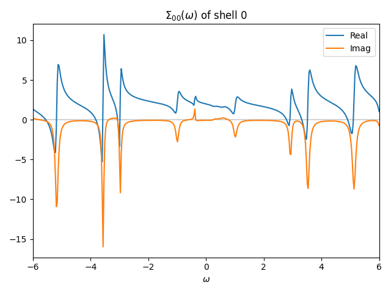

Analytic continuation with the Pade approximation
====================================================

The Pade approximation is a simple and widely used method for the analytic continuation.
The Pade approximation is based on the assumption that the Green's function can be approximated by a rational function of the frequency.
The Pade approximation is implemented in the ``dcore_anacont`` program.

The common parameters of ``dcore_anacont`` is specified in the ``[post.anacont]`` block as follows:

.. code-block::

   [post.anacont]
   solver = pade
   omega_min = -6.0
   omega_max = 6.0
   Nomega = 101
   show_result = false
   save_result = true

``solver`` specifies the method for the analytic continuation.
``omega_min``, ``omega_max``, and ``Nomega`` specify the frequency range and the number of frequency points for the output;
the frequency points are linearly spaced between ``omega_min`` and ``omega_max``.
``show_result`` specifies whether the obtained self-energies :math:`\mathrm{Re}\Sigma_{ij}(\omega)` and :math:`\mathrm{Im}\Sigma_{ij}(\omega)` are displayed on the screen by using Matplotlib.
``save_result`` specifies whether the plots of the obtained self-energies are saved in the ``work/post`` directory as ``sigma_w_{ish}_{iorb}_{jorb}.png``,
where ``ish`` is the shell index, and ``iorb`` and ``jorb`` are the orbital indices.
The output directory ``work/post`` can be changed by the parameter ``dir_work`` in the ``[post]`` block.

The parameters for the Pade approximation are specified in the ``[post.anacont.pade]`` block as follows:

.. code-block::

   [post.anacont.pade]
   iomega_max = 10000
   n_min = 0
   n_max = 100
   eta = 0.01

``iomega_max``, ``n_min``, and ``n_max`` specify how many Matsubara frequencies are used.
First, ``iomega_max`` specifies the cutoff of Matsubara frequency, :math:`\omega_m`.
When ``iomega_max > 0``, solve :math:`\omega_N = \pi/\beta (2N+1) \le \omega_m < \omega_{N+1}` and obtain :math:`N`.
If :math:`N < N_\text{min}` or :math:`N > N_\text{max}`, :math:`N` is replaced by :math:`N_\text{min}` or :math:`N_\text{max}`.
Otherwise (``iomega_max == 0``, default value), :math:`N = N_\text{max}`.
Then, the Matsubara frequencies :math:`\omega_n` for :math:`0 \le n \le N` are used.
When the number of self-energies calculated by the DMFT loop is less than :math:`N`, all the data are used.

``eta`` is the imaginary frequency shift for the analytic continuation, that is, the analytic continuation is performed as :math:`i\omega_n \to \omega + i\eta`.

Example
--------

The following input file is used to perform a DMFT calculation of a Hubbard model on a square lattice with the Pomerol solver and an analytic continuation of the self-energy with the Pade approximation:

:download:`pade.ini <pade.ini>`

.. literalinclude:: pade.ini
   :language: ini

The figure below shows the self-energy in real frequency obtained by analytic continuation (``work/post/sigma_w_0_0_0.png``).

