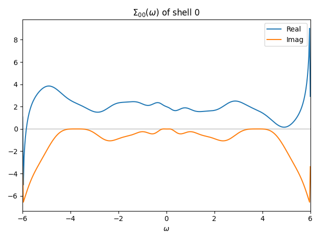

Analytic continuation with the sparse-modeling method
========================================================

The sparse-modeling (SpM) method is a method for the analytic continuation of the self-energy by solving the integral equation

.. math::

  \Sigma(\tau) = \int_{-\infty}^{\infty} d\omega \frac{e^{-\tau \omega}}{1+e^{-\beta\omega}} \Sigma(\omega)
  
where :math:`\Sigma(\tau)` is the self-energy in imaginary time and :math:`\Sigma(\omega)` is the self-energy in real frequency.

In the SpM method, the kernel matrix of the integral equation, :math:`e^{-\tau\omega}/(1+e^{-\beta\omega})` is decomposed by the singular value decomposition (SVD),
and the self-energies :math:`\Sigma(\tau)` and :math:`\Sigma(\omega)` are transformed by the left and right singular vectors, respectively.

The SpM method is implemented in the ``dcore_anacont`` program.
While the SpM method in the original paper uses the ADMM for optimization, the SpM method in the ``dcore_anacont`` program can use more solvers via `the CVXPY package <https://www.cvxpy.org/index.html>`_.

The common parameters of ``dcore_anacont`` is described in :doc:`the section of the Pade approximation <pade>`.
The SpM method is specified by ``solver = spm`` in the ``[post.anacont]`` block.
The parameters for the SpM method are specified in the ``[post.anacont.spm]`` block as follows:

.. code-block::

   [post.anacont.spm]
   solver = ECOS
   n_matsubara = 1000
   n_tau = 101
   n_tail = 5
   n_sv = 30
   lambda = 1e-5

``n_matsubara`` is the number of Matsubara frequencies used. When it is larger than the number of the data obtained by the DMFT calculation, the number of the data is used.
``n_tau`` is the number of imaginary time points.
``n_tail`` is the number of the last Matsubara frequencies used for the tail fitting, :math:`\Sigma(i\omega_n) \sim a/i\omega_n`.
``n_sv`` is the number of singular values used after truncation.
``lambda`` is the coefficient of the L1 regularization term in the optimization.
``solver`` specifies the solver for the optimization.

The parameter of the solver can be specified in the ``[post.anacont.spm.solver]`` block.
In this block, the format of ``name{type} = value`` should be used, for example, ``max_iters{int} = 100``.
Available types are ``int``, ``float``, and ``str``.
Available parameters depend on the solver used.
For details of solvers, see `the CVXPY documentation <https://www.cvxpy.org/tutorial/solvers/index.html>`_.

Example
--------

The following input file is used to perform a DMFT calculation of a Hubbard model on a square lattice with the Pomerol solver and an analytic continuation of the self-energy with the SpM method:

:download:`spm.ini <spm.ini>`

.. literalinclude:: spm.ini
   :language: ini

The figure below shows the self-energy in real frequency obtained by analytic continuation (``work/post/sigma_w_0_0_0.png``).

