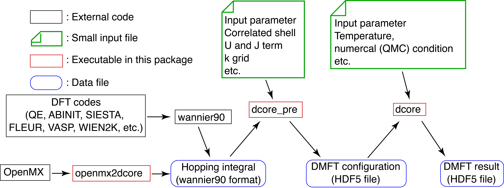

.. _structure:

The central part of :program:`DFTTools`, which is performing the
steps for the DMFT self-consistency cycle, is written following the
same philosophy as the :ref:`TRIQS <triqslibs:welcome>` toolbox. At
the user level, easy-to-use python modules are provided that allow to
write simple and short scripts performing the actual calculation.
The usage of those modules is presented in the user guide of this
:ref:`documentation`. Before considering the user guide, we suggest
to read the following introduction on the general structure of
the :program:`DFTTools` package.

The interface layer
-------------------

Since the input for this DMFT part has to be provided by DMFT
calculations, there needs to be another layer that connects the
python-based modules with the DFT output. Naturally, this layer
depends on the DFT package at hand. At the moment, there is an
interface to the Wien2k band structure package, and a very light 
interface that can be used in a more general setup. Note that this
light interface layer **does not** allow full charge self-consistent
calculations. 

Standard interface
~~~~~~~~~~~~~~~~~~

* Bethe lattice
* Chain lattice
* Square lattice
* Cubic lattice
  
For more details, please see :ref:`dcorepre`.

Wannier90 interface
~~~~~~~~~~~~~~~~~~~

DCore can read files generated by wannier90 code (or same format).

Post-processing
---------------

* (projected) density of states
* correlated band structures (*spaghettis*)

