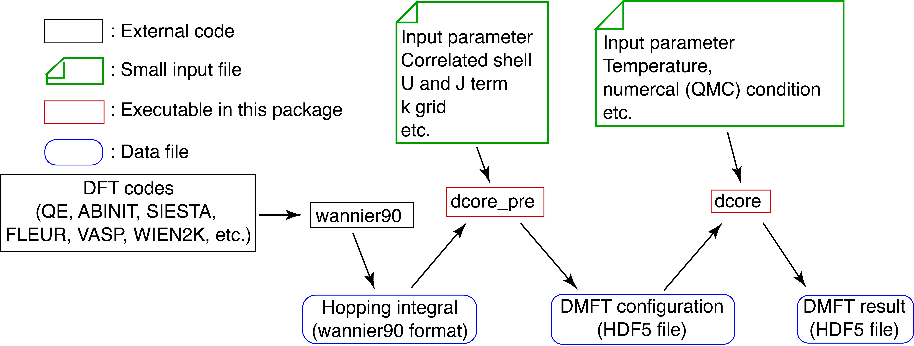

.. _structure:

Minimum introduction: Structure of DCore
========================================

Data flow
---------

**DCore** contains a set of programs which perform dynamical mean-field theory (DMFT) calculations for models and materials.
The structure of programs and data flow for the DMFT calculation is summarized below.

The DMFT calculation includes two **DCore** programs: (i) ``dcore_pre`` and (ii) ``dcore`` as described later.

After the DMFT loop is finished, one can compute dynamical physical quantities such as the density of states and the momentum-resolved spectrum functions using the post-processing tool.
The structure of the post-processing is shown below.

.. image:: images/structure_post.png
   :width: 700
   :align: center

The post-processing tool consists of two **DCore** programs: (iii) ``dcore_anacont`` and (iv) ``dcore_spectrum``.

..
  **DCore** is a set of DMFT (Dynamical Mean Field Theory) programs which works together with other first-principles calculation packages.
  **DCore** supports input hopping parameters in the wannier90 format.
  Simple preset models such as a tight-binding model on the Bethe lattice are also available.
  After the DMFT loop is finished, one can compute physical quantities such as the density of states and the momentum-resolved spectrum functions using the post-processing tool.

..
  **DCore** consists of three layers: (i) interface layer, (ii) DMFT loop, and (iii) post-processing.
  Those are respectively performed by the executables ``dcore_pre``, ``dcore``, and ``dcore_anacont`` and ``dcore_spectrum``.
  Input parameters are provided by a single text file, which is read by all the three programs.
  Data generated by ``dcore_pre`` and ``dcore`` are severally stored in a file with HDF5 format and passed to the next process.

(i) The interface layer ``dcore_pre``
-------------------------------------

..
  The pre-processing tool, ``dcore_pre`` can generate models from the wannier orbitals
  as well as intrinsic model-generator (Standard interface).

``dcore_pre`` generates a HDF5 file necessary for the DMFT loop.
Users specify parameters defining a model such as hopping parameters on a certain lattice, and interactions.
The hopping parameters are given either for **preset models** (e.g., square lattice, Bethe lattice) or using **Wannier90 format**

..
    There are two types of interfaces: **standard interface** for models and **Wannier90 interface** for materials.

    -   Standard interface

        The preset models include

        * Bethe lattice
        * Chain lattice
        * Square lattice
        * Cubic lattice

    ..
      For more details, please see :ref:`inputformat`.

    -   Wannier90 interface

        Results of ab-initio calculations can be imported into **DCore**.
        ``dcore_pre`` reads the hopping parameters in the Wannier90 format and transform to HDF5.

(ii) DMFT loop ``dcore``
------------------------

``dcore`` is the main program for the DMFT calculations.
The effective impurity problem is solved repeatedly to fulfill the self-consistency condition of the DMFT.
For solving the impurity problem, ``dcore`` calls an external program such as the continuous-time quantum Monte Carlo method and the Hubbard-I approximation.

(iii) Analytical continuation ``dcore_anacont``
---------------------------------------------------

The DMFT loop provides the self-energy in the Matsubara frequency domain.
To obtain physical quantities in the real frequency domain, we need to perform the analytical continuation (AC).
``dcore_anacont`` performs the analytical continuation using the Pade approximation or the SpM method.
Note that users can perform AC by using an external program.

(iv) Spectrum calculation ``dcore_spectrum``
---------------------------------------------------

``dcore_spectrum`` computes some physical quantities from the converged solution of the DMFT loop.
Currently, the following quantities can be calculated:

* (projected) density of states
* Correlated band structures (momentum-resolved single-particle excitation spectrum)
