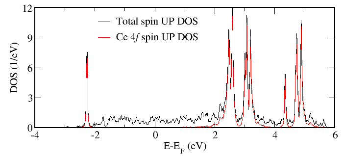

.. _DFTDMFTtutorial:

DFT+DMFT tutorial: Ce with Hubbard-I approximation
==================================================

In this tutorial we will perform DFT+DMFT :program:`Wien2k`
calculations from scratch, including all steps described in the
previous sections. As example, we take the high-temperature
:math:`\gamma`-phase of Ce employing the Hubbard-I approximation for
its localized *4f* shell. 

Wien2k setup
------------

First we create the Wien2k :file:`Ce-gamma.struct` file as described in the `Wien2k manual <http://www.wien2k.at/reg_user/textbooks/usersguide.pdf>`_  
for the :math:`\gamma`-Ce fcc structure with lattice parameter of 9.75 a.u.

.. literalinclude:: images_scripts/Ce-gamma.struct

We initalize non-magnetic :program:`Wien2k` calculations using the :program:`init` script as described in the same manual. 
For this example we specify 3000 :math:`\mathbf{k}`-points in the full Brillouin zone
and LDA exchange-correlation potential (*vxc=5*), other parameters are defaults. 
The Ce *4f* electrons are treated as valence states. 
Hence, the initialization script is executed as follows ::

   init -b -vxc 5 -numk 3000 

and then LDA calculations of non-magnetic :math:`\gamma`-Ce are performed by launching the :program:`Wien2k` :program:`run` script. 
These self-consistent LDA calculations will typically take a couple of minutes.

Wannier orbitals: dmftproj
--------------------------

Then we create the :file:`Ce-gamma.indmftpr` file specifying parameters for construction of Wannier orbitals representing *4f* states:

.. literalinclude:: images_scripts/Ce-gamma.indmftpr

As we learned in the section :ref:`conversion`, the first three lines
give the number of inequivalent sites, their multiplicity (to be in
accordance with the *struct* file) and the maximum orbital quantum
number :math:`l_{max}`. 
The following four lines describe the treatment of Ce *spdf* orbitals by the :program:`dmftproj` program::

   complex
   1 1 1 2          ! l included for each sort
   0 0 0 0          ! l included for each sort
   0

where `complex` is the choice for the angular basis to be used (spherical complex harmonics), in the next line we specify, for each orbital
quantum number, whether it is treated as correlated ('2') and, hence, the corresponding Wannier orbitals will be generated, or uncorrelated ('1'). 
In the latter case the :program:`dmftproj` program will generate projectors to be used in calculations of corresponding partial densities of states (see below). 
In the present case we choose the fourth (i. e. *f*) orbitals as correlated.
The next line specify the number of irreducible representations into which a given correlated shell should be split (or
'0' if no splitting is desired, as in the present case). The fourth line specifies whether the spin-orbit interaction should be switched on ('1') or off ('0', as in the present case).

Finally, the last line of the file ::

   -.40 0.40         ! Energy window relative to E_f

specifies the energy window for Wannier functions' construction. For a
more complete description of :program:`dmftproj` options see its
manual. 

To prepare input data for :program:`dmftproj` we execute lapw2 with the `-almd` option ::
   
   x lapw2 -almd 

Then  :program:`dmftproj` is executed in its default mode (i.e. without spin-polarization or spin-orbit included) ::

   dmftproj 

This program produces the following files:

 * :file:`Ce-gamma.ctqmcout` and :file:`Ce-gamma.symqmc` containing projector operators and symmetry operations for orthonormalized Wannier orbitals, respectively.
 * :file:`Ce-gamma.parproj` and :file:`Ce-gamma.sympar` containing projector operators and symmetry operations for uncorrelated states, respectively. These files are needed for projected density-of-states or spectral-function calculations.
 * :file:`Ce-gamma.oubwin` needed for the charge density recalculation in the case of fully self-consistent DFT+DMFT run (see below).

Now we have all necessary input from :program:`Wien2k` for running DMFT calculations. 

DMFT setup: Hubbard-I calculations in TRIQS
--------------------------------------------

In order to run DFT+DMFT calculations within Hubbard-I we need the corresponding python script, :ref:`Ce-gamma_script`. 
It is generally similar to the script for the case of DMFT calculations with the CT-QMC solver (see :ref:`singleshot`), 
however there are also some differences. First difference is that we import the Hubbard-I solver by::

   from pytriqs.applications.impurity_solvers.hubbard_I.hubbard_solver import Solver

The Hubbard-I solver is very fast and we do not need to take into account the DFT block structure or use any approximation for the *U*-matrix.
We load and convert the :program:`dmftproj` output and initialize the
:class:`SumkDFT <dft.sumk_dft.SumkDFT>` class as described in :ref:`conversion` and
:ref:`singleshot` and then set up the Hubbard-I solver :: 
 
   S = Solver(beta = beta, l = l)

where the solver is initialized with the value of `beta`, and the orbital quantum number `l` (equal to 3 in our case). 

The Hubbard-I initialization `Solver` has also optional parameters one may use:

  * `n_msb`: the number of Matsubara frequencies used. The default is `n_msb=1025`.
  * `use_spin_orbit`: if set 'True' the solver is run with spin-orbit coupling included. To perform actual DFT+DMFT calculations with spin-orbit one should also run   :program:`Wien2k` and :program:`dmftproj` in spin-polarized mode and with spin-orbit included. By default, `use_spin_orbit=False`.
  * `Nmoments`: the number of moments used to describe high-frequency tails of the Hubbard-I Green's function and self-energy. By default `Nmoments = 5`

The `Solver.solve(U_int, J_hund)` statement has two necessary parameters, the Hubbard U parameter `U_int` and Hund's rule coupling `J_hund`. Notice that the solver constructs the full 4-index `U`-matrix by default, and the `U_int` parameter is in fact the Slater `F0` integral. Other optional parameters are:

  * `T`: matrix that transforms the interaction matrix from complex spherical harmonics to a symmetry adapted basis. By default, the complex spherical harmonics basis is used and `T=None`.
  * `verbosity`: tunes output from the solver. If `verbosity=0` only basic information is printed, if `verbosity=1` the ground state atomic occupancy and its energy are printed, if `verbosity=2` additional information is printed for all occupancies that were diagonalized. By default, `verbosity=0`. 

  * `Iteration_Number`: the iteration number of the DMFT loop. Used only for printing. By default   `Iteration_Number=1`
  * `Test_Convergence`: convergence criterion. Once the self-energy is converged below `Test_Convergence` the Hubbard-I solver is not called anymore. By default `Test_Convergence=0.0001`.

We need also to introduce some changes in the DMFT loop with respect that used for CT-QMC calculations in :ref:`singleshot`. 
The hybridization function is neglected in the Hubbard-I approximation, and only non-interacting level 
positions (:math:`\hat{\epsilon}=-\mu+\langle H^{ff} \rangle - \Sigma_{DC}`) are required.
Hence, instead of computing `S.G0` as in :ref:`singleshot` we set the level positions::

   # set atomic levels:
   eal = SK.eff_atomic_levels()[0]
   S.set_atomic_levels( eal = eal )

The part after the solution of the impurity problem remains essentially the same: we mix the self-energy and local 
Green's function and then save them in the hdf5 file . 
Then the double counting is recalculated and the correlation energy is computed with the Migdal formula and stored in hdf5.

Finally, we compute the modified charge density and save it as well as correlational correction to the total energy in 
:file:`Ce-gamma.qdmft` file, which is then read by lapw2 in the case of self-consistent DFT+DMFT calculations.

Running single-shot DFT+DMFT calculations
------------------------------------------

After having prepared the script one may run one-shot DMFT calculations by
executing :ref:`Ce-gamma_script` with :program:`pytriqs` on a single processor:

   `pytriqs Ce-gamma.py`

or in parallel mode:

   `mpirun -np 64 pytriqs Ce-gamma.py`

where :program:`mpirun` launches these calculations in parallel mode and
enables MPI. The exact form of this command will, of course, depend on
mpi-launcher installed in your system, but the form above applies to
99% of the system setups.

Running self-consistent DFT+DMFT calculations
---------------------------------------------

Instead of doing a one-shot run one may also perform fully self-consistent
DFT+DMFT calculations, as we will do now. We launch these
calculations as follows :

   `run -qdmft 1`

where `-qdmft` flag turns on DFT+DMFT calculations with
:program:`Wien2k`, and one computing core. We
use here the default convergence criterion in :program:`Wien2k` (convergence to
0.1 mRy in energy). 

After calculations are done we may check the value of correlation ('Hubbard') energy correction to the total energy::
    
   >grep HUBBARD Ce-gamma.scf|tail -n 1
   HUBBARD ENERGY(included in SUM OF EIGENVALUES):           -0.012866

In the case of Ce, with the correlated shell occupancy close to 1 the Hubbard energy is close to 0, while the DC correction to energy is about J/4 in accordance with the fully-localized-limit formula, hence, giving the total correction :math:`\Delta E_{HUB}=E_{HUB}-E_{DC} \approx -J/4`, which is in our case is equal to -0.175 eV :math:`\approx`-0.013 Ry.

The band ("kinetic") energy with DMFT correction is ::

   >grep DMFT Ce-gamma.scf |tail -n 1
   KINETIC ENERGY with DMFT correction:                      -5.370632

One may also check the convergence in total energy::
   
   >grep :ENE Ce-gamma.scf |tail -n 5
   :ENE  : ********** TOTAL ENERGY IN Ry =       -17717.56318334
   :ENE  : ********** TOTAL ENERGY IN Ry =       -17717.56342250
   :ENE  : ********** TOTAL ENERGY IN Ry =       -17717.56271503
   :ENE  : ********** TOTAL ENERGY IN Ry =       -17717.56285812
   :ENE  : ********** TOTAL ENERGY IN Ry =       -17717.56287381

Post-processing and data analysis
---------------------------------

Within Hubbard-I one may also easily obtain the angle-resolved spectral function (band
structure) and integrated spectral function (density of states or DOS).  In
difference with the CT-QMC approach one does not need to do an
analytic continuations to get the
real-frequency self-energy, as it can be calculated directly
in the Hubbard-I solver.

The corresponding script :ref:`Ce-gamma_DOS_script` contains several new parameters ::

   ommin=-4.0    # bottom of the energy range for DOS calculations 
   ommax=6.0     # top  of the energy range for DOS calculations
   N_om=2001     # number of points on the real-energy axis mesh
   broadening = 0.02 # broadening (the imaginary shift of the real-energy mesh)

Then one needs to load projectors needed for calculations of
corresponding projected densities of states, as well as corresponding
symmetries::

  Converter.convert_parpoj_input()
  
To get access to analysing tools we initialize the
:class:`SumkDFTTools <dft.sumk_dft_tools.SumkDFTTools>` class ::

   SK = SumkDFTTools(hdf_file=dft_filename+'.h5', use_dft_blocks=False)

After the solver initialization, we load the previously calculated
chemical potential and double-counting correction.  Having set up
atomic levels we then compute the atomic Green's function and
self-energy on the real axis:: 

   S.set_atomic_levels( eal = eal )
   S.GF_realomega(ommin=ommin, ommax = ommax, N_om=N_om,U_int=U_int,J_hund=J_hund)

put it into SK class and then calculated the actual DOS::

   SK.dos_parproj_basis(broadening=broadening)

We may first increase the number of **k**-points in BZ to 10000 by executing :program:`Wien2k` program :program:`kgen` ::
  
   x kgen

and then by executing :ref:`Ce-gamma_DOS_script` with :program:`pytriqs`::

   pytriqs Ce-gamma_DOS.py

In result we get the total DOS for spins `up` and `down` (identical in our paramagnetic case) in :file:`DOScorrup.dat` and :file:`DOScorrdown.dat` files, respectively, as well as projected DOSs written in the corresponding files as described in :ref:`analysis`. 
In our case, for example, the files :file:`DOScorrup.dat` and :file:`DOScorrup_proj3.dat` contain the total DOS for spin *up* and the corresponding projected DOS for Ce *4f* orbital, respectively. They are plotted below.

As one may clearly see, the Ce *4f* band is split by the local Coulomb interaction into the filled lower Hubbard band and empty upper Hubbard band (the latter is additionally split into several peaks due to the Hund's rule coupling and multiplet effects). 
