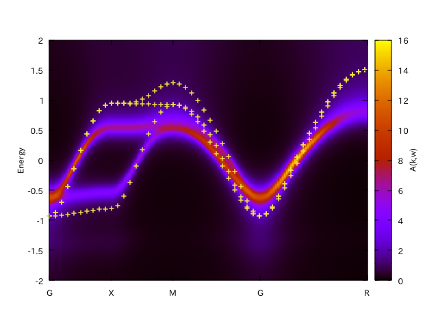

.. _programs:

Programs
========

DCore has four programs, ``dcore_pre``, ``dcore``, ``dcore_check``  and ``dcore_post``.
All programs can read input files of the same type and get the information by using blocks.
For details of input parameters defined in each block, see the next section.

================= ================================================== ====================
Program           Blocks to read from the input file                 Output HDF files
================= ================================================== ====================
``dcore_pre``     [model], [system]                                  *seedname*.h5
``dcore``         [model], [system], [impurity-solver], [control]    *seedname*.out.h5
``dcore_check``   [model], [tool]                                    ---
``dcore_post``    [model], [system], [impurity-solver], [tool]       ---
================= ================================================== ====================

Pre-processing : ``dcore_pre``
~~~~~~~~~~~~~~~~~~~~~~~~~~~~~~

This program generates model HDF5 file (*seedname*.h5) by reading parameters defined in ``[model]`` and ``[system]`` blocks.
You need to execute this program before running the main program, ``dcore``.

::

   $ dcore_pre input-file

Main program : ``dcore``
~~~~~~~~~~~~~~~~~~~~~~~~

This program performs DMFT cycle and output the self energy etc. into a HDF5
file (*seedname*.out.h5) by reading parameters defined in ``[model]``, ``[system]``, ``[impurity-solver]`` and ``[control]`` blocks.

::

   $ dcore input-file

Convergence-check : ``dcore_check``
~~~~~~~~~~~~~~~~~~~~~~~~~~~~~~~~~~~

This program is used to check the convergence of the DMFT loop by reading parameters defined in ``[model]`` and ``[tool]`` blocks.

::

   $ dcore_check input-file

``dcore_check`` shows the history of the calculation of the chemical potential and the average of the self energy for imaginary frequencies,

.. math::

   \Sigma_{\rm Ave} (i \omega_n) = 
   \left[\sum_i^{\rm shell} \sum_{\alpha \beta}^{N_{\rm orb}^i} \Sigma_{\alpha \beta}(i\omega)\right]
   /\left[\sum_i^{\rm shell} N_{\rm orb}^{i}\right],

at the last seven iterations.

.. image:: ../tutorial/square/convergence.png
   :width: 500
   :align: center

The maximum frequency of this plot is specified with the parameter ``omega_check``
in the ``[tool]`` block.

Also, this program generates a text file, *seedname*_sigma.dat, which contains
the local self energy at the final step as follows:

::

   # Local self energy at imaginary frequency
   # [Column] Data
   # [1] Frequency
   # [2] Re(Sigma_{shell=0, spin=up, 0, 0})
   # [3] Im(Sigma_{shell=0, spin=up, 0, 0})
   # [4] Re(Sigma_{shell=0, spin=down, 0, 0})
   # [5] Im(Sigma_{shell=0, spin=down, 0, 0})
   -157.001093 0.994751 0.006358 0.994751 0.006358
   -156.844013 0.994751 0.006365 0.994751 0.006365
   -156.686934 0.994751 0.006371 0.994751 0.006371
   :
           
Post-processing : ``dcore_post``
~~~~~~~~~~~~~~~~~~~~~~~~~~~~~~~~

This program computes the total DOS ( *seedname*_dos.dat) and *k*-resolved spectral function　(*seedname*_akw.dat) from the outputted HDF5 file (*seedname*.out.h5).
This program reads the parameters defined in the ``[model]``, ``[system]``, ``[impurity-solver]`` and ``[tool]`` blocks.

.. code-block:: bash

   $ dcore_post input-file

The computed spectral function can be drawn by
   
.. code-block:: bash

   $ gnuplot [seedname]_akw.gp

Using this gnuplot script, you can also see the original (DFT) band structure as follows if either
*seedname*_band.dat (Wannier90 output) or dir-wan/dat.iband (RESPACK output) exists.

"+" indicates the original band structure.
The original band structure is shifted by the chemical potential specified by ``mu`` in ``[system]`` block.
