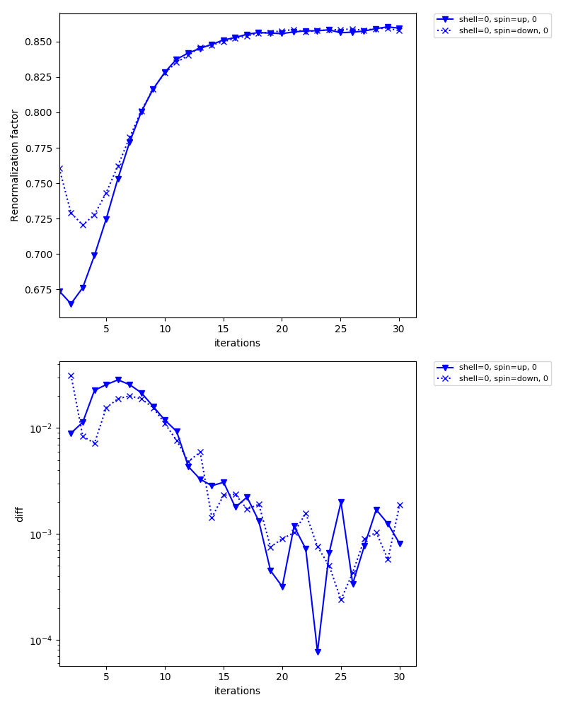
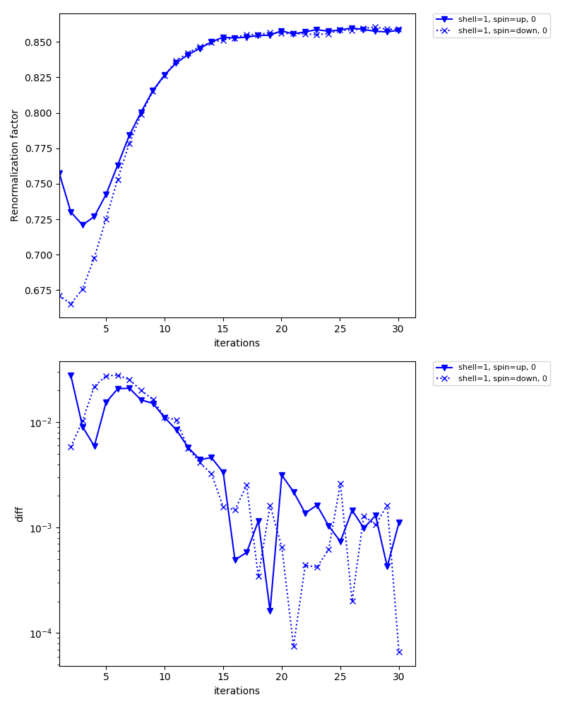

Antiferromagnetic state in 3D Hubbard model
============================================

In this tutorial, you will learn the following:

* How to define a lattice model using the Wannier90 interface
* How to calculate antiferromagnetic states
* How to set an initial guess for the self-energy

As a particular example, we consider the Hubbard model on a cubic lattice with nearest neighbor hopping of :math:`t=1`.
Within the single-site DMFT approximation, the model shows an antiferromagnetic transition at low temperature.
The transition temperature was estimated as :math:`T_\mathrm{c}/t\simeq 0.5` in `a previous study <https://link.aps.org/doi/10.1103/PhysRevB.72.060411>`_.
In this tutorial, we compute the antiferromagetic state below :math:`T_\mathrm{c}` using the ALPS/CT-HYB solver.
The complete input file is shown below.

.. literalinclude:: cubic.ini
   :language: ini

Define lattice model
---------------------------

First, we define the hopping matrix of the 3D Hubbard model with a 2x2x2 unit cell.
Running :download:`mk_hr.py <mk_hr.py>` generates a text file (cubic_hr.dat) in the Wannier90 format.
The unit cell contains eight sites whose internal coordinates are (0, 0, 0), (0, 0, 1), (0, 1, 0), (0, 1, 1), (1, 0, 0), (1, 0, 1), (1, 1, 0), (1, 1, 1).

We now assume an antiferromagnetic order at :math:`q=(\pi, \pi, \pi)`.
To this end, we assign the eight sites (correlated shells) to two inequivalent shells by using the `equiv` parameter in the model section.

.. code-block:: bash

   python mk_hr.py

Generate initial guess for self-energy
--------------------------------------

Second, we generate intial guesses for the (static) self-energies on the two inequivalent shells.
Running :download:`mk_init_se.py <mk_init_se.py>` generates `init_se_up.txt` and `init_se_down.txt`.

.. code-block:: bash

   python mk_init_se.py

Self-consistent calculations
------------------------------
Now, DMFT calculations can be done as usual.

.. code-block:: bash

   export MPIRUN="mpirun"
   dcore_pre cubic.ini > output-pre
   dcore cubic.ini --np 48 > output
   dcore_post cubic.ini --np 48 > output-post

In the standard output of `dcore`, you will see that the magnetic moments converge to :math:`\simeq 0.43` (86 % of the saturated moment).

.. code-block:: bash

   Density Matrix
   
     Inequivalent Shell  0
   
       Spin  up
             0.929-0.000j
       Eigenvalues:  [0.92877164]
   
       Spin  down
             0.072-0.000j
       Eigenvalues:  [0.07229858]
   
       Magnetic moment (only spin contribution, S=1/2 gives 0.5)
         mx, my, mz : 0.0 0.0 0.428236533178
   
     Inequivalent Shell  1
   
       Spin  up
             0.078-0.000j
       Eigenvalues:  [0.0779467]
   
       Spin  down
             0.930-0.000j
       Eigenvalues:  [0.92994248]
   
       Magnetic moment (only spin contribution, S=1/2 gives 0.5)
         mx, my, mz : 0.0 0.0 -0.425997888424

Inequivalent shell0

Inequivalent shell1

