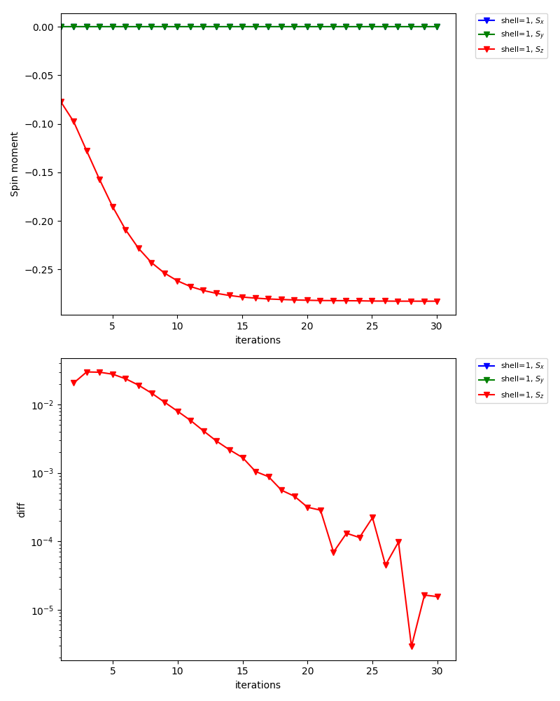

Antiferromagnetic state in 3D Hubbard model
============================================

In this tutorial, you will learn the following:

* How to define a lattice model using the Wannier90 interface
* How to calculate antiferromagnetic states
* How to set an initial guess for the self-energy

As a particular example, we consider the Hubbard model on a square lattice (:doc:`/tutorial/square/square`).
Within the single-site DMFT approximation, the model shows an antiferromagnetic transition at low temperature (the Mermin-Wagner theorem is not fulfilled in DMFT).
The transition temperature was estimated as :math:`T_\mathrm{c}/t\simeq 0.23` for :math:`U=4` (see for example ??).
This means that the parameter set used in [:doc:`/tutorial/square/square`] is actually in the antiferromagnetic phase.
In this tutorial, we compute the antiferromagetic solution below :math:`T_\mathrm{c}` using a CT-HYB solver.

.. in `a previous study <https://link.aps.org/doi/10.1103/PhysRevB.72.060411>`_.

The complete input file is shown below:

:download:`square_afm.ini`

.. literalinclude:: square_afm.ini
   :language: ini

Define lattice model
---------------------------

..
    First, we define the hopping matrix of the 3D Hubbard model with a 2x2x2 unit cell.
    Running :download:`mk_hr.py <mk_hr.py>` generates a text file (cubic_hr.dat) in the Wannier90 format.
    The unit cell contains four sites whose internal coordinates are (0, 0), (0, 1), (1, 0), (1, 1).

    We now assume an antiferromagnetic order characterized by the wave vector :math:`q=(\pi, \pi)`.
    To this end, we assign the four sites (correlated shells) to two inequivalent shells by using the ``corr_to_inequiv`` parameter in the model section.

First, we define the hopping matrix of the 2D Hubbard model with a 2x2 unit cell.
Running the script :download:`mk_hr_2.py` as

.. code-block:: bash

   python mk_hr_2.py

a text file in the Wannier90 format is generated (:download:`afm_dim2_hr.dat`).
The unit cell contains four sites whose internal coordinates are (0, 0), (0, 1), (1, 0), (1, 1).

We now assume an antiferromagnetic order characterized by the wave vector :math:`q=(\pi, \pi)`.
To this end, we assign the four sites (correlated shells) to two inequivalent shells by using the ``corr_to_inequiv`` parameter in the model section.

Generate initial guess for self-energy
--------------------------------------

..
    Second, we generate intial guesses for the (static) self-energies on the two inequivalent shells.
    Running :download:`mk_init_se.py <mk_init_se.py>` generates `init_se_up.txt` and `init_se_down.txt`.

    .. code-block:: bash

        python mk_init_se.py

Second, we set up intial guesses for the (static) self-energies on the two inequivalent shells.
For one shell, we use the text file :download:`init_se_up.txt` containing

.. code-block:: bash

    0 0 0 -1.0 0.0
    1 0 0 1.0 0.0

and for the other, we use :download:`init_se_down.txt` containing

.. code-block:: bash

    0 0 0 1.0 0.0
    1 0 0 -1.0 0.0

Thus, spin moments tend to turn up on inequivalent shell0 and turn down on shell1.

Self-consistent calculations
------------------------------
Now, DMFT calculations can be done as usual.

.. code-block:: bash

   export MPIRUN="mpirun"
   dcore_pre cubic.ini > output-pre
   dcore cubic.ini --np 48 > output
   dcore_post cubic.ini --np 48 > output-post

In the standard output of ``dcore``, you will see that the magnetic moments converge to :math:`\simeq 0.28` (57 % of the saturated moment).

.. code-block:: bash

    Density Matrix

      Inequivalent Shell  0

        Spin  up
              0.784-0.000j
        Eigenvalues:  [0.7837032]

        Spin  down
              0.218+0.000j
        Eigenvalues:  [0.2182982]

        Magnetic moment (only spin contribution, S=1/2 gives 0.5)
          mx,my,mz= 0.0 0.0 0.282702499302

      Inequivalent Shell  1

        Spin  up
              0.218-0.000j
        Eigenvalues:  [0.21842138]

        Spin  down
              0.784-0.000j
        Eigenvalues:  [0.78360972]

        Magnetic moment (only spin contribution, S=1/2 gives 0.5)
          mx,my,mz= 0.0 0.0 -0.282594174364

The graph below is one of the figures generated by ``dcore_check``, which shows the convergence of the spin moment for inequivalent shell0:

.. image:: check/iter_spin-ish0.png
   :width: 80%
   :align: center

For inequivalent shell1, the spin moment points the opposite directions:

