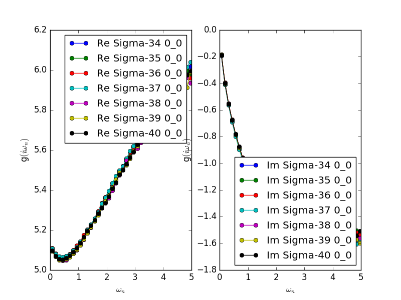

Tutorial with t2g Bethe lattice
===============================

:download:`dmft_bethe.ini <bethe-t2g/dmft_bethe.ini>`

An interesting phenomena in multi-orbital models in spin-freezing phenomena found in
`P. Werner, E. Gull, M. Troyer and A. J. Millis, PRL 101, 166405 (2008) <https://journals.aps.org/prl/abstract/10.1103/PhysRevLett.101.166405>`_.
They solved a t2g three-orbital model on a bethe lattice by means of DMFT.
The so-called spin-freezing phenomena is signaled by a peculiar frequency dependence of the self-energy: :math:`\mathrm{Im}\Sigma(i\omega_n) \propto \omega_n^{0.5}`.

.. literalinclude:: bethe-t2g/dmft_bethe.ini
                              
Pre-process : ``dcore_pre``
---------------------------

.. First, we have to generate the lattice model as
.. The h5 file stores information of the model including the lattice structure, hopping parameters, interaction parameters.

We first generate a h5 file that is necessary for DMFT calculations.
The script ``dcore_pre`` is invoked for this purpose:

.. code-block:: bash

   $ dcore_pre dmft_bethe.ini

.. Then it outputs model HDF5 file (``bethe.h5``).
.. Parameters in [model] and [system] blocks are reads in the input file.

If succeeded, a h5 file named *seedname*.h5 (``bethe.h5`` in the present case) is generated.

DMFT loop : ``dcore``
---------------------

The DMFT loop is performed by ``dcore`` program.
In this tutorial, we use continuous-time QMC implementaion of ALPSCore/CT-HYB.
The runtime of the impurity solver is set to 300 sec.
You should not use the Hubbard-I solver for a metallic system because the Hubbard-I solver always gives an insulating self-energy.
One can run the program by

.. code-block:: bash

   $ dcore dmft_bethe.ini

.. Then it generates the result HDF5 file.

We run this sample with 24 MPI processes.
Each self-consistent step takes around 5 min,
most of which is spend for solving an impurity problem by QMC.
40 iterations take around 200 min.
Results for the self-energy and Green's function in each iteration are accumulated into a h5 file named *seedname*.out.h5 (``bethe.out.h5`` in the present case).

One can check convergence of DMFT loop by using ``dcore_check`` program.
You can run it with the following command, if X window system is available:

.. code-block:: bash

   $ dcore_check dmft_bethe.ini

If X window is not available or you prefer plotting in a file, use ``--output`` option to specify output file name

.. code-block:: bash

   $ dcore_check dmft_bethe.ini --output=convergence.png

The extension can be eps, jpg, etc.

.. We can find the following standard output.

``dcore_check`` program prints the value of the chemical potential at each iteration on the standard output:

::

  Total number of Iteration: 40

  Iter  Chemical-potential
  1 -0.751277456949
  2 0.433793958315
  3 1.2459725253
  4 1.85732193608
  5 2.36220722607
  6 2.77062276749
  7 3.09108807381
  8 3.36629802149
  9 3.58851057325
  10 3.7695090938
  11 3.90938635404
  12 4.00410075355
  13 4.09341242903
  14 4.12292839182
  15 4.15049754864
  16 4.20834882743
  17 4.25119528758
  18 4.27064749027
  19 4.27850735354
  20 4.27969108336
  21 4.27273280534
  22 4.3030438833
  23 4.29424976349
  24 4.32252238768
  25 4.31798807725
  26 4.34401171006
  27 4.34281367005
  28 4.35844282894
  29 4.347290631
  30 4.32740842847
  31 4.32654893316
  32 4.32403615806
  33 4.34877682256
  34 4.35656979282
  35 4.35943070738
  36 4.36991558208
  37 4.35933570028
  38 4.35062637919
  39 4.34769943323
  40 4.35412706392

.. We also can see the imaginary-time self-energy at last seven iterations.

``dcore_check`` also plots the self-energy for the last seven iterations in Matsubara-frequency domain.

If those results are not converged, one can repeat the DMFT iteration using the same ini file. ``dcore`` program automatically finds results in the previous run and continue iterations.

