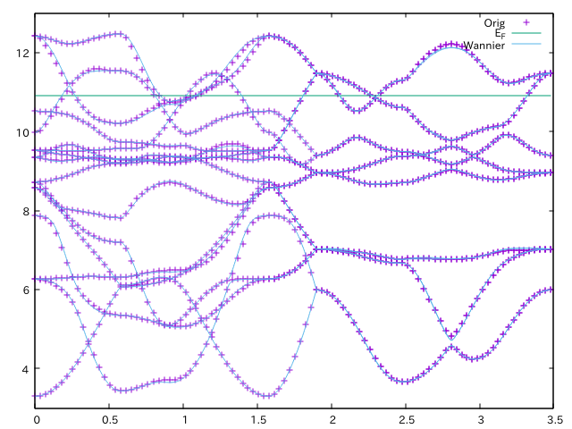

NiS
===

.. include:: ../../warning_compatibility.rst

Crystal structure of NiS (drawn by `VESTA <http://jp-minerals.org/vesta/en/>`_).

.. image:: struct_nis.png
   :width: 200
   :align: center

SCF calculation of Quantum ESPRESSO
-----------------------------------

:download:`scf_nis.in <scf_nis.in>`

.. literalinclude:: scf_nis.in

The pseudopotentials are downloaded from
`Ni.pbe-n-kjpaw_psl.0.1.upf <http://theossrv1.epfl.ch/uploads/Main/NoBackup/Ni.pbe-n-kjpaw_psl.0.1.upf>`_ and
`S.pbe-n-kjpaw_psl.0.1.upf <http://theossrv1.epfl.ch/uploads/Main/NoBackup/S.pbe-n-kjpaw_psl.0.1.upf>`_.

.. code-block:: bash

   $ mpirun -np 4 pw.x -in scf_nis.in

Wannierization
--------------

Generate Bloch orbitals for the Wannier
~~~~~~~~~~~~~~~~~~~~~~~~~~~~~~~~~~~~~~~

Perform non-scf calculation for generating Bloch orbitals that are used
in the wannierization.

:download:`nscf_nis.in <nscf_nis.in>`

.. literalinclude:: nscf_nis.in

This *k*\ -grid is generated as follows:

.. code-block:: bash

   $ kmesh.pl 4 4 4

where ``kmesh.pl`` is located in the `utility/` directory of Wannier90.

Then, run ``pw.x`` as

.. code-block:: bash

   $ mpirun -np 4 pw.x -in nscf_nis.in

Pre-process for Wannier90
~~~~~~~~~~~~~~~~~~~~~~~~~

Pre-process with wannier90 program.
It is always required before pw2wannier.x runs.

:download:`nis.win <nis.win>`

.. literalinclude:: nis.win

.. note::

   The order of projection is important for the following DMFT calculation.
   If there are both correlated shells and non-correlated shell,
   the correlated shells must appear first, i.e.

   ::

      begin projections
      Correlated_shell_1
      Correlated_shell_2
      :
      Non-correlated_shell_1
      Non-correlated_shell_2
      :
      end projections

This *k* grid is generated as follows:

.. code-block:: bash

   $ kmesh.pl 4 4 4 wan

.. code-block:: bash

   $ wannier90.x -pp nis

QE to wannier90 interface
~~~~~~~~~~~~~~~~~~~~~~~~~

:download:`pw2wan_nis.in <pw2wan_nis.in>`

.. literalinclude:: pw2wan_nis.in

.. code-block:: bash

   $ mpirun -np 4 pw2wan.x -in pw2wan_nis.in

Wannier90
~~~~~~~~~

Execute ``wannier90.x`` for the actual wannierization.
The input file is the same as that for the pre-processing run.

.. code-block:: bash

   $ wannier90.x nis

(Optional) Check wannierization
~~~~~~~~~~~~~~~~~~~~~~~~~~~~~~~

If you want to check the quality of the wannierization,
you can plot the original and the wannier-interpolated band structure simultaneously.

First, compute the band structure with the following input file:

:download:`band_nis.in <band_nis.in>`

.. literalinclude:: band_nis.in

.. code-block:: bash

   $ mpiexec -np 4 pw.x -in band_nis.in

:download:`bands_nis.in <bands_nis.in>`

.. literalinclude:: bands_nis.in

.. code-block:: bash

   $ mpiexec -np 4 bands.x -in bands_nis.in

.. .. code-block:: gnuplot
.. code-block:: guess

   plot [][3:13] "bands.out.gnu" u 1:2 w p tit "Orig", 10.913 tit "E_F",\
    "nis_band.dat" u ($1*0.549):2 tit "Wannier" w l

DMFT calculation
----------------

:download:`nis.ini <nis.ini>`

.. literalinclude:: nis.ini
   :language: ini

DMFT setup: dcore_pre
~~~~~~~~~~~~~~~~~~~~~~

.. code-block :: bash

   $ dcore_pre nis.ini

Running self-consistent DMFT calculation: dcore
~~~~~~~~~~~~~~~~~~~~~~~~~~~~~~~~~~~~~~~~~~~~~~~

.. code-block :: bash

   $ dcore nis.ini

Post-processing and data analysis: dcore_post
~~~~~~~~~~~~~~~~~~~~~~~~~~~~~~~~~~~~~~~~~~~~~~

.. code-block :: bash

   $ dcore_post nis.ini
   $ gnuplot nis_akw.gp

.. image:: akw_nis.png
   :width: 500
   :align: center

"+" indicates the original band structure.
