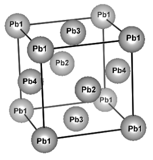

..
    Pb with spin-orbit interaction (multi-atom with QMC)

Multi-atoms: Revisiting Pb
==========================

.. include:: ../../warning_compatibility.rst

In this tutorial, we perform the DMFT calculation of Pb with the spin-orbit interaction.
We compute fcc-Pb, however, we treat it as a four-atom system in the simple cubic cell.
This redundancy is just for demonstrating **how we compute multi-shell system with SOI**.
In this tutorial, we use TRIQS/cthyb solver with SOI;
this requires additional options of CMake for that solver.
For more details, please see :ref:`installation`.

SCF calculation of Quantum ESPRESSO
-----------------------------------

:download:`scf_pb4.in <scf_pb4.in>`

.. literalinclude:: scf_pb4.in

The pseudopotential is included in 
`rel-pbe.0.3.1.tgz <http://theossrv1.epfl.ch/uploads/Main/NoBackup/rel-pbe.0.3.1.tgz>`_
of the `THEOS PSLibrary <http://theossrv1.epfl.ch/Main/Pseudopotentials>`_.

.. code-block:: bash
                
   $ mpirun -np 4 pw.x -in scf_pb4.in 

Wannierization
--------------   
   
Generate Bloch orbitals for the Wannier
~~~~~~~~~~~~~~~~~~~~~~~~~~~~~~~~~~~~~~~

Perform non-scf calculation for generating Bloch orbitals that are used
in the wannierization.

:download:`nscf_pb4.in <nscf_pb4.in>`

.. literalinclude:: nscf_pb4.in

This *k*\ -grid is generated as follows:

.. code-block:: bash

   $ kmesh.pl 3 3 3

where ``kmesh.pl`` is located in the `utility/` directory of Wannier90.

Then, run ``pw.x`` as

.. code-block:: bash
                
   $ mpirun -np 4 pw.x -in nscf_pb4.in 

Pre-process for Wannier90
~~~~~~~~~~~~~~~~~~~~~~~~~

Pre-process with wannier90 program.
It is always required before pw2wannier.x runs.
We will wannierize Pb 6p orbitals.

:download:`pb4.win <pb4.win>`

.. literalinclude:: pb4.win

.. note::

   For the following DMFT calculation,
   the projection of the Wannier function should be the correct order, namely,

   ::

      begin projections
      First_shell(u)
      First_shell(d)
      Second_shell(u)
      Second_shell(d)
      :
      end projections

The *k* grid is generated as follows:

.. code-block:: bash

   $ kmesh.pl 3 3 3 wan

.. code-block:: bash
                
   $ wannier90.x -pp pb4 

QE to wannier90 interface
~~~~~~~~~~~~~~~~~~~~~~~~~

:download:`pw2wan_pb4.in <pw2wan_pb4.in>`

.. literalinclude:: pw2wan_pb4.in

.. code-block:: bash
                
   $ mpirun -np 4 pw2wan.x -in pw2wan_pb4.in 

Wannier90
~~~~~~~~~   

Execute ``wannier90.x`` for the actual wannierization.
The input file is the same as that for the pre-processing run.

.. code-block:: bash
                
   $ wannier90 pb

DMFT calculation
----------------   
   
:download:`pb4.ini <pb4.ini>`

.. literalinclude:: pb4.ini
   :language: ini
                              
DMFT setup: dcore_pre
~~~~~~~~~~~~~~~~~~~~~~

.. code-block :: bash

   $ dcore_pre pb4.ini

Running self-consistent DFT+DMFT : dcore
~~~~~~~~~~~~~~~~~~~~~~~~~~~~~~~~~~~~~~~~~

.. code-block :: bash

   $ mpiexec -np 432 dcore pb4.ini

Post-processing and data analysis: dcore_post
~~~~~~~~~~~~~~~~~~~~~~~~~~~~~~~~~~~~~~~~~~~~~~

.. code-block :: bash

   $ dcore_post pb4.ini
   $ gnuplot pb4_akw.gp

.. image:: akw_pb4.png
   :width: 500
   :align: center

"+" indicates the original band structure.
