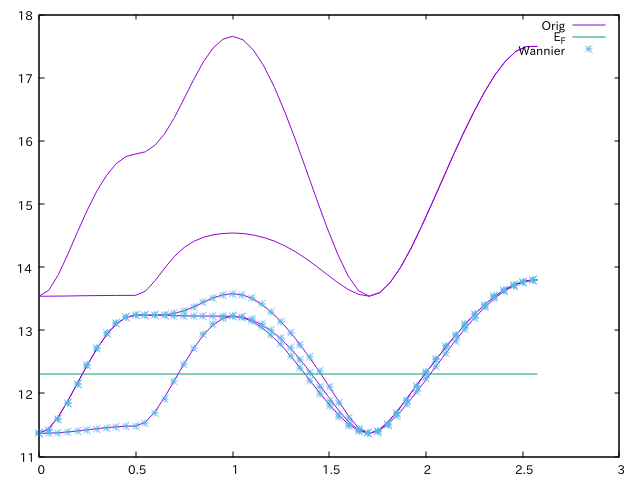

.. _DFTDMFTtutorial:

Tutorial with QuantumESPRESSO and wannier90
===========================================

Quantum ESPRESSO is a first-principles program package based on
the plane wave and pseudopotentials.

wannier90 is a library and post-processing tool for generating wannier orbitals
from results by many DFT programs.

In this tutorial we will perform DFT+DMFT calculations of SrVO\ :sub:`3`.

SCF calculation of Quantum ESPRESSO
-----------------------------------

:download:`scf.in <qe/scf.in>`

.. literalinclude:: qe/scf.in

The pseudopotentials are downloaded from
`Sr.pbe-spn-kjpaw_psl.0.2.3.upf <http://theossrv1.epfl.ch/uploads/Main/NoBackup/Sr.pbe-spn-kjpaw_psl.0.2.3.upf>`_,
`V.pbe-spn-kjpaw_psl.0.2.3.upf <http://theossrv1.epfl.ch/uploads/Main/NoBackup/V.pbe-spn-kjpaw_psl.0.2.3.upf>`_, and
`O.pbe-n-kjpaw_psl.0.1.upf <http://theossrv1.epfl.ch/uploads/Main/NoBackup/O.pbe-n-kjpaw_psl.0.1.upf>`_.

.. code-block:: bash
                
   $ mpirun -np 4 pw.x -in scf.in 

Wannierization
--------------   
   
Generate Bloch orbitals for the Wannier
~~~~~~~~~~~~~~~~~~~~~~~~~~~~~~~~~~~~~~~

Perform non-scf calculation for generating Bloch orbitals that are used
in the wannierization.

:download:`nscf.in <qe/nscf.in>`

.. literalinclude:: qe/nscf.in

This *k*\ -grid is generated as follows:

.. code-block:: bash

   $ kmesh.pl 4 4 4

where ``kmesh.pl`` is located in the `utility/` directory of Wannier90.

Then, run ``pw.x`` as

.. code-block:: bash
                
   $ mpirun -np 4 pw.x -in nscf.in 

Preprocess for Wannier90
~~~~~~~~~~~~~~~~~~~~~~~~

Pre-process with wannier90 program.
It is always required before pw2wannier.x runs.

:download:`srvo3.win <qe/srvo3.win>`

.. literalinclude:: qe/srvo3.win

This *k* grid is generated as follows:

.. code-block:: bash

   $ kmesh.pl 4 4 4 wan

.. code-block:: bash
                
   $ wannier90.x -pp srvo3 

QE to wannier90 interface
~~~~~~~~~~~~~~~~~~~~~~~~~

:download:`pw2wan.in <qe/pw2wan.in>`

.. literalinclude:: qe/pw2wan.in

.. code-block:: bash
                
   $ mpirun -np 4 pw2wan.x -in pw2wan.in 

Wannier90
~~~~~~~~~   

Execute ``wannier90.x`` for the actual wannierization.
The input file is the same as that for the preprocessing run.

.. code-block:: bash
                
   $ wannier90 srvo3 

(Optional) Check wannierization
~~~~~~~~~~~~~~~~~~~~~~~~~~~~~~~   

If we want to check the quarity of the wannierization,
we plot the original and the wannier-interpolated band structure simalteneously.

First, we compute the band structure with the following input file:

:download:`band.in <qe/band.in>`

.. literalinclude:: qe/band.in

.. code-block:: bash

   $ mpiexec -np 4 pw.x -in band.in

:download:`bands.in <qe/bands.in>`

.. literalinclude:: qe/bands.in

.. code-block:: bash

   $ mpiexec -np 4 bands.x -in bands.in

.. code-block:: gnuplot

   plot [][11:18] "bands.out.gnu" u 1:2 w p tit "Orig", 12.3116 tit "E_F", "srvo3_band.dat" u ($1*0.6146):2 tit "Wannier" w l

DMFT calculation
----------------   
   
:download:`dmft_qe.ini <qe/dmft_qe.ini>`

.. literalinclude:: qe/dmft_qe.ini
                              
DMFT setup: pydmft_pre
~~~~~~~~~~~~~~~~~~~~~~

.. code-block :: bash

   $ pydmf_pre dmft_qe.ini

Running self-consistent DFT+DMFT : pydmft
~~~~~~~~~~~~~~~~~~~~~~~~~~~~~~~~~~~~~~~~~

.. code-block :: bash

   $ pydmf dmft_qe.ini

Post-processing and data analysis: pydmft_post
~~~~~~~~~~~~~~~~~~~~~~~~~~~~~~~~~~~~~~~~~~~~~~

.. code-block :: bash

   $ pydmf_post dmft_qe.ini
