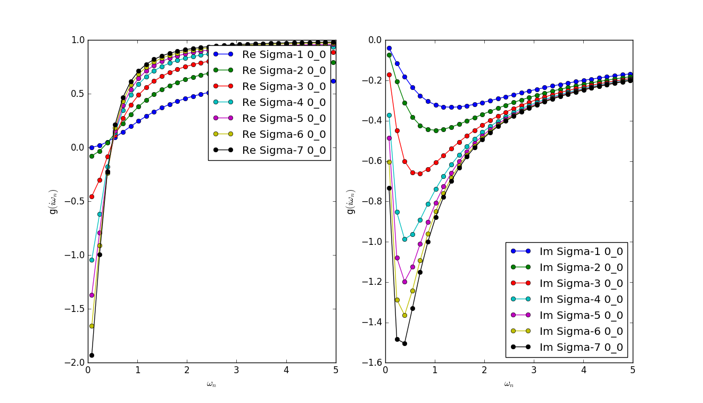
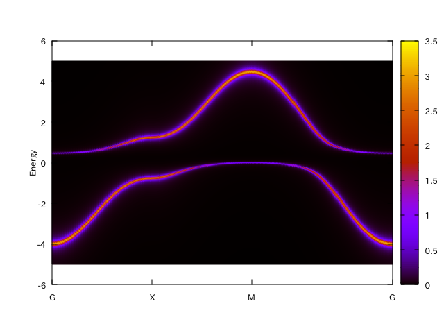
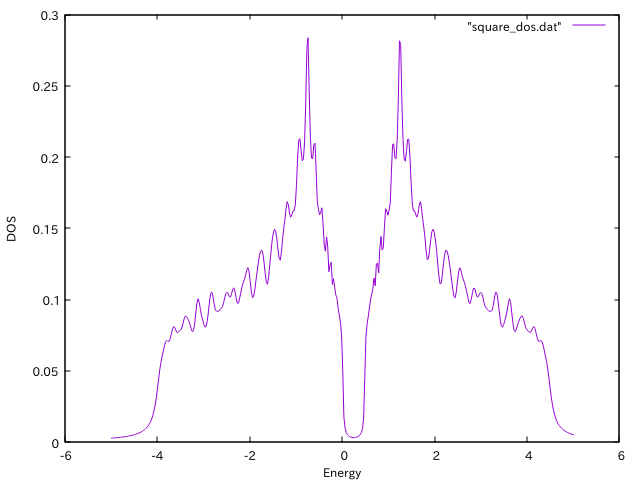

Tutorial with single-band 2D Hubbard model
==========================================

:download:`dmft_square.ini <square/dmft_square.ini>`

.. literalinclude:: square/dmft_square.ini

Pre-process : ``dcore_pre``
---------------------------

First, we have to generate the lattice model as

.. code-block:: bash

   $ pydmf_pre dmft_square.ini

Then it outputs model HDF5 file (``square.h5``).

SCF cycle : ``dcore``
---------------------

The DMFT loop is performed by ``dcore`` program.
In this example, we use the Hubbard-I approximation for the impurity solver.

.. code-block:: bash

   $ pydmf dmft_square.ini

Then it generates the result HDF5 file.
We can check the convergence of the SCF cycle by using ``dcore_check`` program.

.. code-block:: bash

   $ pydmf_check dmft_square.ini

We can find the following standard output.

::

   Total number of Iteration: 10

   Iter  Chemical-potential
   1 0.0
   2 0.350471842936
   3 0.499576874374
   4 0.590504345604
   5 0.64888137395
   6 0.686284855018
   7 0.71112006693
   8 0.727786131759
   9 0.739550620867
   10 0.748282590054

We also can see the imaginary-time self-energy at last seven iterations.

Spectrul function : ``dcore_post``
----------------------------------
We can calculate spectrum function and density of states by using ``dcore_post`` program.
For Hubbard-I solver, the self-energy is first calculated in ``dcore_post``.
The calculation is done by typing the following command:

.. code-block:: bash

   $ pydmf_post dmft_square.ini

After finishing the calculation,
``square_akw.dat``, ``square_akw.gp`` and ``square_dos.dat`` are generated.
The data of spectral function are output into ``square_akw.dat``.
By using ``square_akw.gp``, we can easily plot the result:

.. code-block:: bash

   $ gnuplot square_akw.gp

The data of density of states are output into ``square_dos.dat``.
We can see the results by using gnuplot as follows:

.. code-block:: gnuplot

   gnuplot> set xlabel "Energy"
   gnuplot> set ylabel "DOS"
   gnuplot> plot "square_dos.dat" w l

