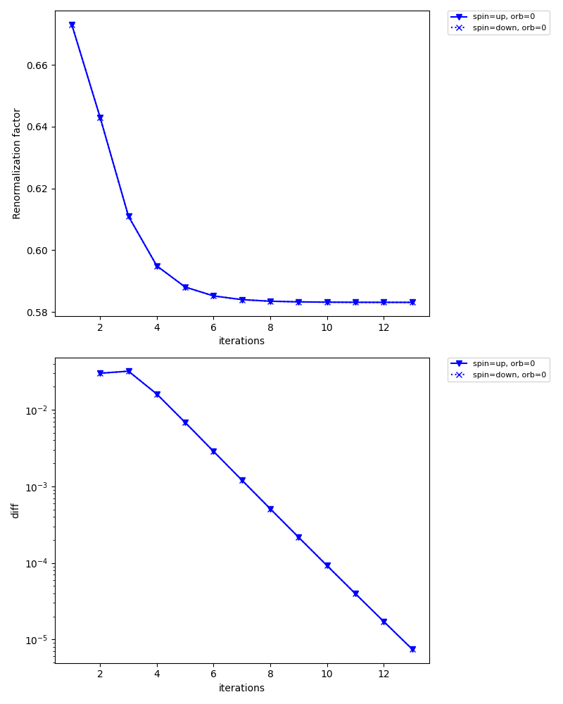

The first example: 2D Hubbard model
===================================

The first example is the two-dimensional Hubbard model.
We first use the exact diagonalization solver :doc:`pomerol </impuritysolvers/pomerol/pomerol>` and see the influence of the Coulomb repulsion U on the single-particle excitations. A better result can be obtained using the CT-QMC solver, which will be explained later.

The file below shows the full input file for solving the 2D Hubbard model:

:download:`dmft_square_pomerol.ini <dmft_square_pomerol.ini>`

.. literalinclude:: dmft_square_pomerol.ini
   :language: ini

The parameter ``exec_path{str}`` in ``[impurity_solver]`` block needs to be edited, if ``pomerol2dcore`` executable is not in your path: Please specify the full path to ``pomerol2dcore``.

Pre-process : ``dcore_pre``
---------------------------

.. First, we have to generate the lattice model as
.. The h5 file stores information of the model including the lattice structure, hopping parameters, interaction parameters.

We first generate an HDF5 file that is necessary for DMFT calculations.
The script ``dcore_pre`` is invoked for this purpose:

.. code-block:: bash

   $ dcore_pre dmft_square.ini

.. Then it outputs model HDF5 file (``square.h5``).
.. Parameters in [model] and [system] blocks are reads in the input file.

Then, an HDF5 file named *seedname*.h5 (``square.h5`` in the present case) is generated.

DMFT loop : ``dcore``
---------------------

One can perform a DMFT self-consistent calculation with ``dcore`` program.
In this tutorial, we use the exact diagonalization solver just for simplicity.
One can run the program by

.. code-block:: bash

   $ dcore dmft_square.ini --np 1

with a single process. 

It takes several minutes. You may run it with MPI to reduce the computational time.
Results for the self-energy and Green's function in each iteration are accumulated into an HDF5 file named *seedname*.out.h5 (``square.out.h5`` in the present case).

One can check the convergence of DMFT iterations using ``dcore_check`` program as follows:

.. code-block:: bash

   $ dcore_check dmft_square.ini

``dcore_check`` program prints the value of the chemical potential at each iteration on the standard output:

::

      @ Reading dmft_square_pomerol.ini ...
    Loading dc_imp and dc_energ...
    Loading Sigma_iw...
      Total number of Iteration: 13

      Iter  Chemical-potential
      1 2.0
      2 2.0
      3 2.0
      4 2.0
      5 2.0
      6 2.0
      7 2.0
      8 2.0
      9 2.0
      10 2.0
      11 2.0
      12 2.0
      13 2.0
     Output check_test/sigma.dat
     Output check_test/sigma_ave.png
     Output check_test/iter_mu.dat
     Output check_test/iter_mu.png
     Output check_test/iter_sigma-ish0.png
     Output check_test/iter_sigma.dat

      Done

.. We also can see the imaginary-time self-energy at last seven iterations.

The value of the chemical potential does not change now because ``fix_mu = True`` is specified. ``dcore_check`` generates several figures as well as data files in text format.
For instance, ``check/iter_sigma-ish0.png`` shows how the renormalization factor converges for each orbital.

The iteration is terminated when the diff (lower figure) reaches ``converge_tol = 1e-5`` at the 13th iteration.

Analytical continuation of the self-energy : ``dcore_anacont``
---------------------------------------------------------------------

The self-energy is calculated in the imaginary-time domain in the DMFT loop and saved as ``seedname_sigma_iw.npz``.
The analytical continuation from Matsubara frequency to real frequencies is required to calculate the spectral function.
DCore provides a program ``dcore_anacont`` for this purpose.
Parameters for the analytical continuation are specified in the ``[post.anacont]`` block in the input file.
``omega_min`` and ``omega_max`` is the minimum and maximum frequency for the output.
``Nomega`` is the number of frequency points.
``solver`` is the solver for the analytical continuation; "pade" is the Pade approximation and "spm" is the sparse modeling method.
Hyperparameters for the solver can be specified in the ``[post.anacont.pade]`` or ``[post.anacont.spm]`` block.

.. code-block:: bash

   $ dcore_anacont dmft_square.ini

The result is stored in ``post/sigma_w.npz``.

Spectral function : ``dcore_spectrum``
---------------------------------------

After calculating the self-energy on the real-frequency axis, we can also calculate other real-frequency quantities such as the density of states and the momentum-dependent single-particle excitations using ``dcore_spectrum`` program.

.. In the Hubbard-I solver, the self-energy on the real-frequency axis can be directly computed (no analytical continuation is required).
.. Hence, the impurity problem is solved once more in ``dcore_post``.

The calculation is done by the following command:

.. code-block:: bash

   $ dcore_spectrum dmft_square.ini --np 1

After finishing the calculation,
results are stored in ``post`` directory.
The data of momentum-resolved spectral functions are output into ``akw.dat``.
We can easily plot the result by using the script file ``akw.gp`` for gnuplot:

.. ``square_akw.dat``, ``square_akw.gp`` and ``square_dos.dat`` are generated.

.. code-block:: bash

   $ cd post
   $ gnuplot akw.gp

In the graph shown below, the left and right panels correspond to up-spin and down-spin components, respectively.

.. image:: pomerol/post/akw.png
   :width: 80%
   :align: center

Here, we have tuned the range of the coloar bar by the command ``set cbrange[0:0.8]`` to get better figure.
The band width seems reduced than the noninteracting one, 8, but the artificial structure around E=1 and -1 makes it difficult to judge.

The numerical result for the density of states is stored in ``dos.dat``.
We can plot it using gnuplot as follows:

.. code-block:: gnuplot

   set xlabel "Energy"
   set ylabel "DOS"
   plot "dos.dat" w l

The result is shown below.

.. image:: pomerol/post/dos.png
   :width: 80%
   :align: center

Another impurity solver: CTHYB-SEG
----------------------------------

The spectrum presented above shows some artificial features due to a limited number of the bath sites. The infinite limit of the baths (a continuous hybridization function) can be treated with the CT-QMC method. Here, we use the hybridization expansion CT-QMC solver :doc:`ALPS/cthyb-seg </impuritysolvers/alpscore_ctseg/ctseg>`.

The file below shows the input file for ALPS/cthyb-seg:

:download:`dmft_square_ctseg.ini <dmft_square_ctseg.ini>`

.. literalinclude:: dmft_square_ctseg.ini
   :language: ini

``/path/to/alps_cthyb`` in ``[impurity_solver] exec_path{str}`` should be replaced with a full path to ``alps_cthyb`` executable in your environment.
Unlike in the ED solver, we do not use ``converge_tol`` parameter, since the automatic convergence check requires a special care for QMC solvers.

The workflow of the DCore calculation is the same as the ED solver.
Please note that it takes a longer time to run ``dcore`` command than the ED solver. It takes about **20 minutes** to finish the calculation because each QMC calculation takes 60 seconds (``MAX_TIME{int} = 60``), and the maximum number of the DMFT iterations is 20 (``max_step = 20``).

The figures below show the momentum-resolved spectral functions and the density of states computed after the self-consistent calculations using 8 processes (``--np 8``):

.. image:: ctseg/post/akw.png
   :width: 700
   :align: center

.. image:: ctseg/post/dos.png
   :width: 700
   :align: center

The artificial features observed in the ED solver has gone. This graph shows characteristics for correlated bands such as renormalized band width, low-energy quasiparticles (sharp peak), and broadening away from the Fermi level.

We note that spectra computed using the Pade analytical continuation is extremely sensitive to statistical errors. For this reason, this figure might not be reproduced even with the same input. In such cases, try improving the QMC accuracy by increasing the number of MPI processes or by increasing ``MAX_TIME{int}`` parameter.
